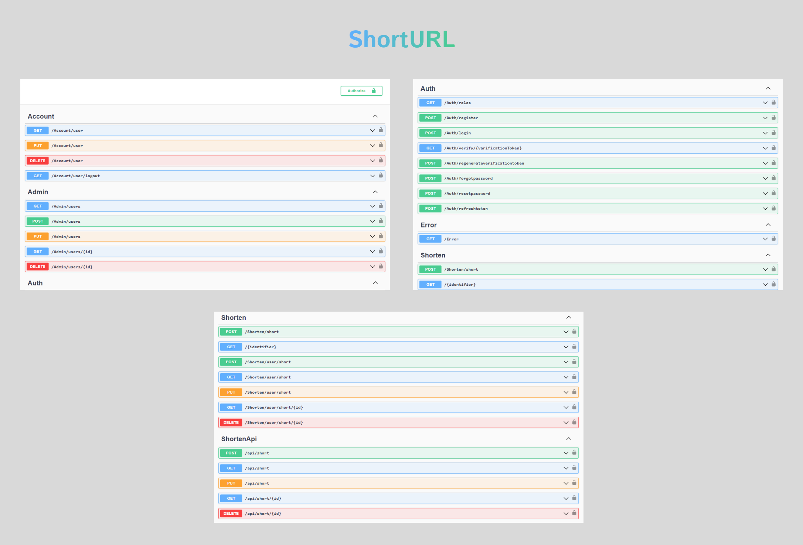
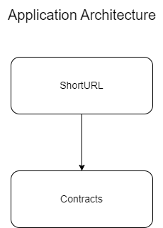
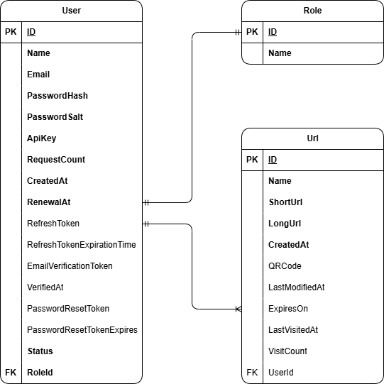

# ShortURL ✂

## Introduction 📜

ShortURL is a URL shortening service built on `.NET` that offers a wide range of features, including multiple URL management and monitoring, QR code generation, API key access, and more.

## Screenshots 📸

## Index 🧾
- [Features](#features-)
- [Architecture](#architecture-)
- [Database](#database-)
- [Technology](#technology-)
- [Techniques](#techniques-)

## Features ✨

1. Role base user `Authentication` and `Authorisation` using modern `JWT Bearer Token`
2. Admin endpoint for `user` managment.
3. URL Shorten
    * Anonymous User
        - Short URLs created by anonymous users will be automatically deleted after `24 hours`
    * Authenticated User
        - Authenticated users can generate URLs with various options, such as expiration date and QR code
        - Once the link is generated, the user can edit it.
        - Users can delete URLs at any time
        - Each ShortURL keeps track of data including the number of visits, last access date, and other details
5. Apikey Access
    * After logging in, each user receives their own `API key`, allowing for up to `10,000` requests per month.
    * The `API key` will be automatically renewed each month.

## Architecture 🛠

## Database 🧱

## Technology 🚀

* [Web API](https://dotnet.microsoft.com/en-us/apps/aspnet/apis)
* [ADO.NET](https://learn.microsoft.com/en-us/dotnet/framework/data/adonet/ado-net-overview)
* [MS SQL Server](https://www.microsoft.com/en-in/sql-server/sql-server-downloads)
* [QRCoder](https://www.nuget.org/packages/QRCoder)

## Techniques 🛠

> * Layered Architecture
> * Repository Pattern
> * Options Pattern
> * Dependency Injection
> * Stored Procedure